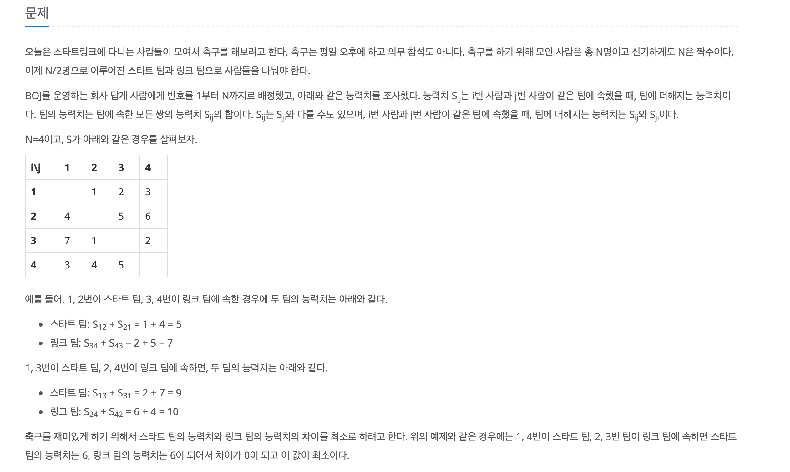
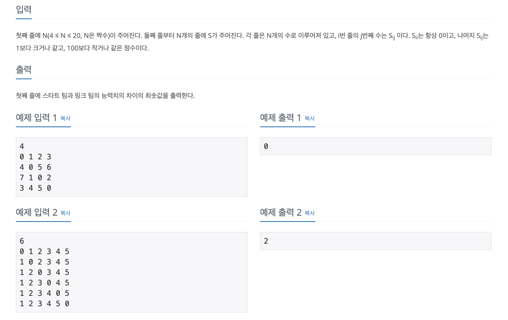
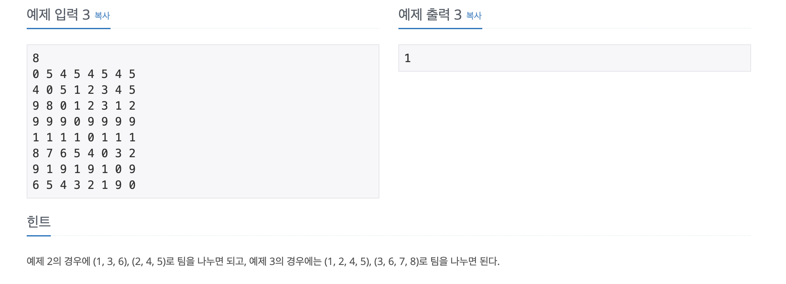
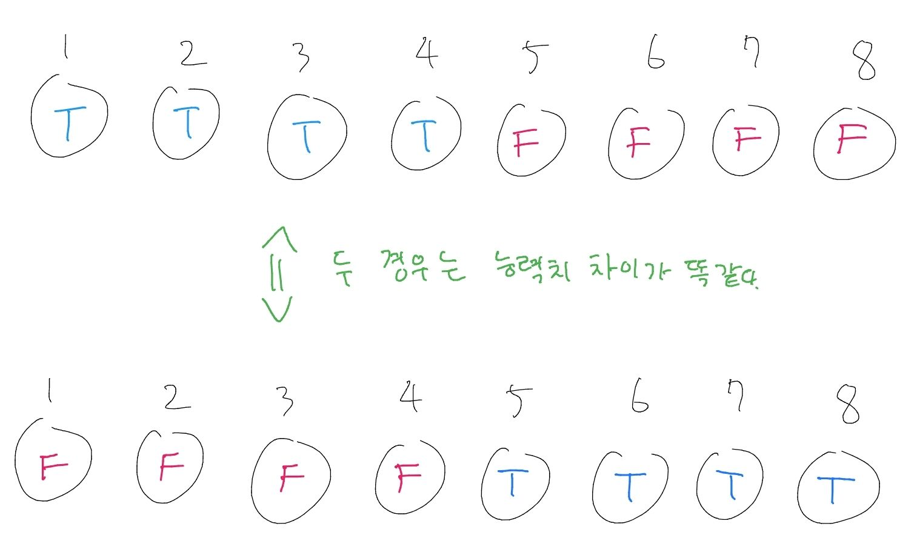

### [스타트와 링크](https://www.acmicpc.net/problem/14889)
- - -

- - -
### 문제 접근 방법
1. N명이 두 팀으로 나누는 구조는 boolean 배열을 통해 분류시킬 수 있다.
2. 입력의 조건에서 N 값이 최대 20까지 이므로 20 x 20 크기의 배열을 생성하게 된다. 이는 그다지 크지 않는 수이기 때문에 브루트 포스 방법으로 접근할 수 있다. O(n^2)
3. 브루트 포스 탐색 방법으로 dfs 를 이용하여 탐색해가며, 팀의 인원수가 N / 2 가 되면 능력치 계산을 하면 된다.
4. dfs 에서 첫 번째 depth 에서는 1 ~ (N / 2) 까지만 탐색하면 된다. (N / 2) + 1 부터는 기존에 탐색했던 부분에서 서로 팀만 바뀌었기 때문에 같은 경우의 수이다.

<pre><code>for (int i = 1; i < (N / 2) + 1; i++) {
    solve(i, 0);
}
</code></pre>

<pre><code>
public static void solve(int start, int people) {
        if (people == (N / 2)) {
            int teamTrue = 0;
            int teamFalse = 0;

            for (int i = 1; i < N + 1; i++) {
                for (int j = 1; j < N + 1; j++) {
                    if (team[i] && team[j]) teamTrue += S[i][j];
                    if (!team[i] && !team[j]) teamFalse += S[i][j];
                }
            }

            ans = Math.min(ans, Math.abs(teamTrue - teamFalse));
            return;
        }

        team[start] = true;
        for (int i = start; i < N; i++) {
            solve(i + 1, people + 1);
        }
        team[start] = false;
    }</code></pre>