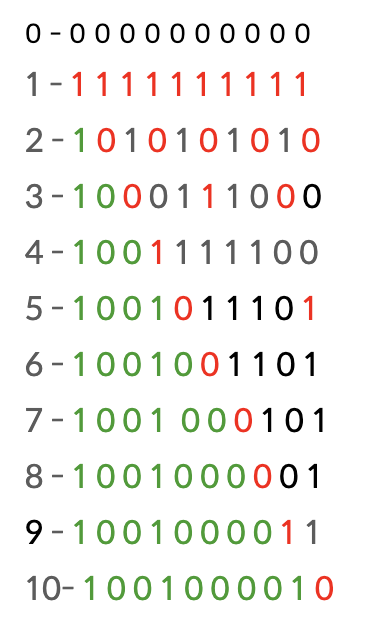

### [만취한 상범](https://www.acmicpc.net/problem/6359)
- - -

- - -
### 문제 접근 방법
1. 처음에는 약수의 개수가 짝수일 경우 문이 닫혀있고, 홀수일 경우 문이 열린다는 생각으로 접근
2. 약수의 개수를 구하기 위해 소인수 분해가 필요하다고 생각하였고, 에라토스테네스의 체를 이용하여 소수들을 구하려고 함
3. 약수의 개수를 구하는 과정에 반복되는 계산이 많다고 판단
4. 나이브하게 바텀업 방식으로 2중 반복문을 이용하여 각 문들을 열었다, 닫았다를 계산함.
5. 최종적으로 열려있는 문들의 개수를 더하여 답을 도출


```

for (int i = 1; i <= n; i++) {
    for (int j = 1; i * j <= n; j++) {
        prison[i * j] = !prison[i * j];
    }
}

```

- - -

#### 더 간결한 해결 방법
> 풀이 출처 : https://penglog.tistory.com/81

 N을 10까지 답을 나열하면 아래와 같은 결과가 나온다. <br />

> 이미지 출처 : https://penglog.tistory.com/81

위의 이미지에서 보면 이전 라운드의 값이 메모이제이션된 것을 볼 수 있다. <br/>
그리고 또 다른 규칙은 N 라운드 수행 후 열려있는 문은 N 의 제곱수인 것을 확인할 수 있다. <br/>
따라서 아래와 같이 간결하게 풀이 될 수 있다.
```
while (t-- > 0) {
    int n = Integer.parseInt(br.readLine());

    bw.write((int) Math.sqrt(n) + "\n");
}

```