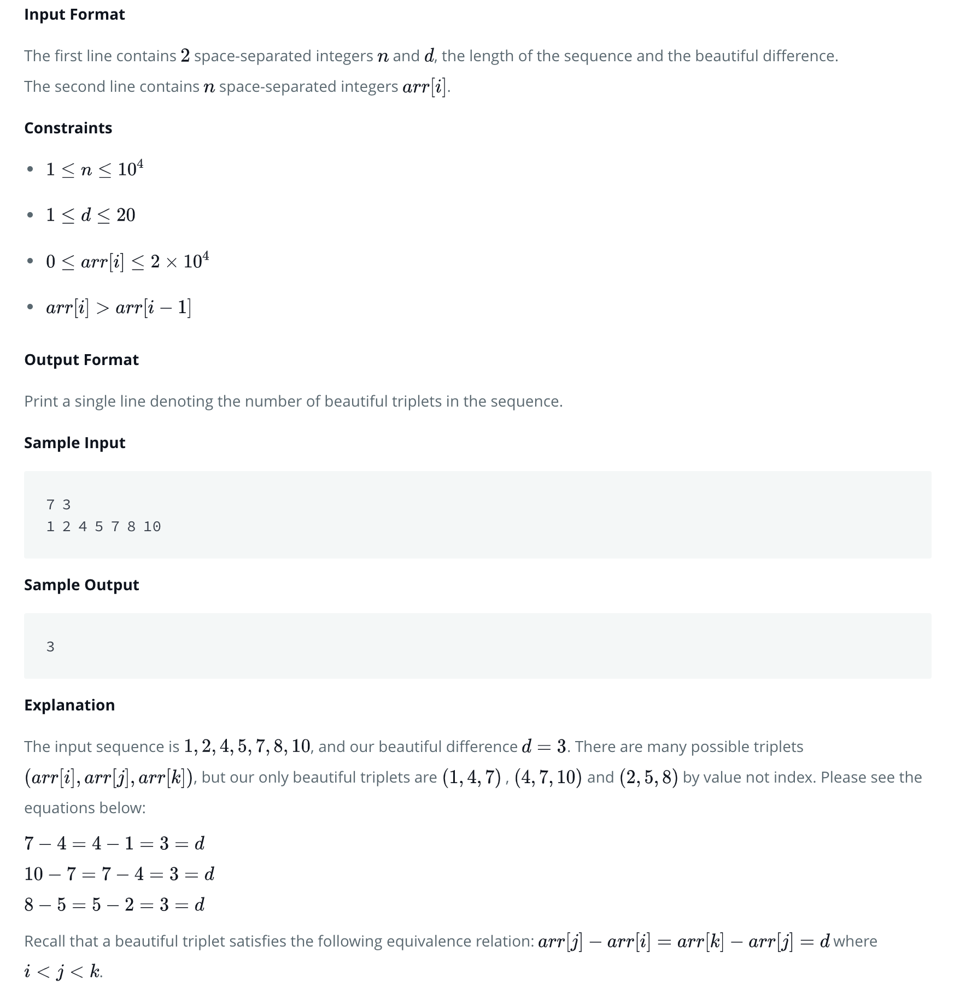

### [HackerRank - Beautiful Triplets](https://www.hackerrank.com/challenges/beautiful-triplets/problem)
- - -
### 문제 요약
주어진 배열 arr 과 d 값이 주어질 때, arr 에서 길이가 3이고, 공차가 d 인 등차 수열이 몇 개인지 구하는 문제.

- - -
### 접근 방법
1. 처음에는 브루트 포스 방법으로 dfs 방법을 고려해봄.
2. 어차피 길이가 3인 등차 수열을 구하는 것이므로 나이브하게 3중 for 문으로 풀어봄.
3. 단, n 의 최대값이 10^4 이고, arr 은 오름차순으로 입력되기 때문에 arr\[i\] - arr\[i - d\] 값이 d 보다 크면 break 를 걸어 가능성이 없는 연산에 대해 적절히 끊어주어야함.

## 첫 풀이
<pre><code>
    static int beautifulTriplets(int d, int[] arr) {
        int ans = 0;

        for (int i = 0; i < arr.length - 2; i++) {
            for (int j = i + 1; j < arr.length - 1; j++) {

                if (arr[j] - arr[i] > d) break;
                else if (arr[j] - arr[i] < d) continue;

                boolean flag = false;

                for (int k = j + 1; k < arr.length; k++) {

                    if (arr[k] - arr[j] > d)
                        break;
                    else if (arr[k] - arr[j] == d) {
                        flag = true;
                        ans++;
                        break;
                    }
                }

                if (flag) break;
            }
        }

        return ans;
    }
</code></pre>

`Map 자료구조를 이용하면 훨씬 단순하고 빠른 시간에 해결이 가능함.`
## 두 번째 풀이.
<pre><code>
    static int beautifulTriplets(int d, int[] arr) {
        int ans = 0;

        Map<Integer, Integer> map = new HashMap<>();

        for (int i : arr) {
            if (!map.containsKey(i)) {
                map.put(i, 1);
            } else {
                map.put(i, map.get(i) + 1);
            }

            if (map.containsKey(i - d) && map.containsKey(i - (d * 2))) {
                ans += map.get(i - d) * map.get(i - (d * 2));
            }
        }

        return ans;
    }
</code></pre>

- - -
위와 같이 Map 을 이용해서 해당 값을 직접 인덱스로써 접근하면 쉽게 풀이가 가능해진다.